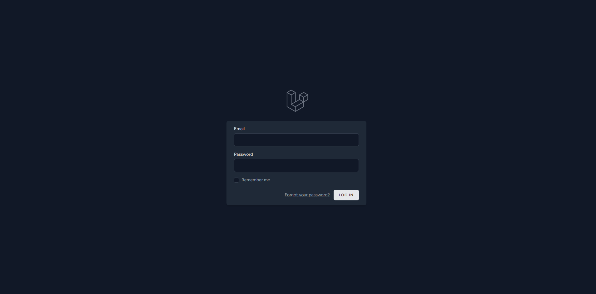
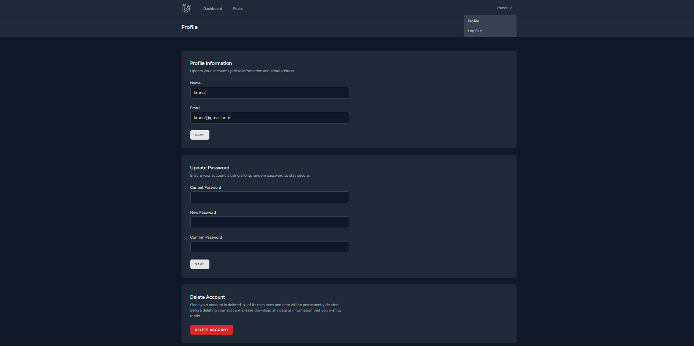
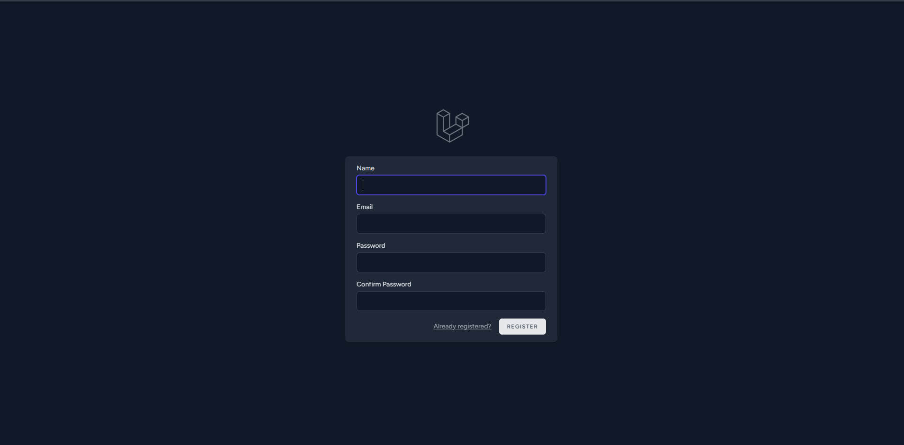
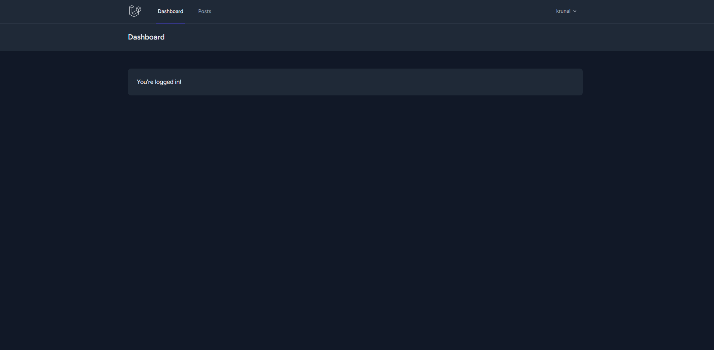
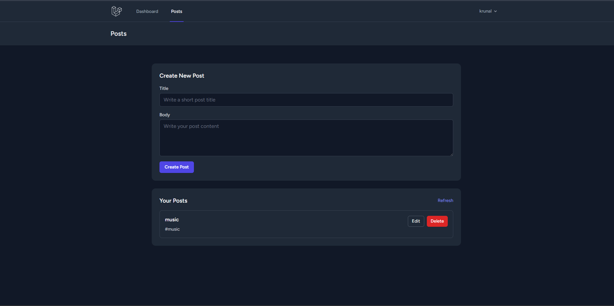
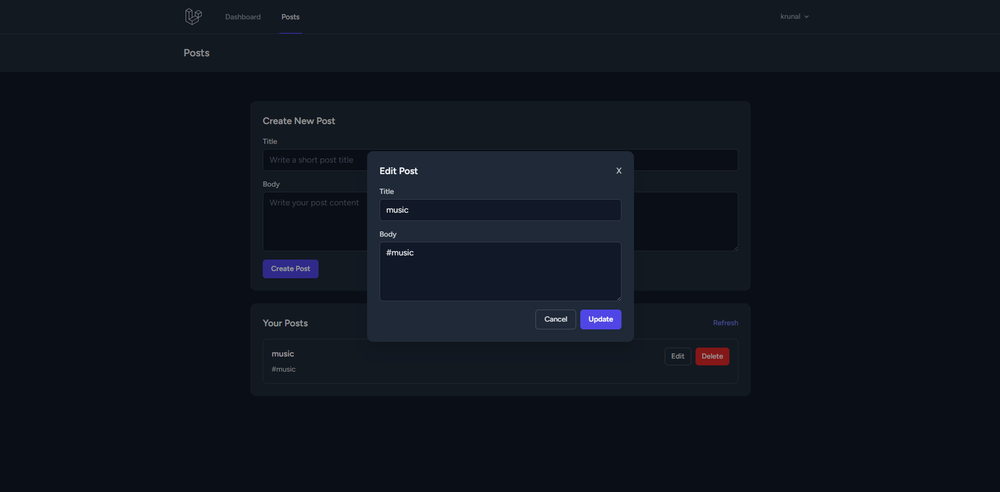

# Laravel 13 Authentication + CRUD Mini Project

A beginner-friendly mini project built with **Laravel 13** that demonstrates complete user authentication and CRUD (Create, Read, Update, Delete) operations.

This project uses **Laravel Breeze** for authentication scaffolding and a simple **Posts** module for practicing core Laravel development flow.

## Features

- User registration, login, logout, and password confirmation (Laravel Breeze)
- Protected dashboard and profile management
- Full CRUD for posts
- Authorization: users can manage only their own posts
- Server-side validation for form inputs
- Responsive UI using Blade + Tailwind CSS + Alpine.js
- JSON-friendly CRUD responses for smooth frontend interaction

## Tech Stack

- **Framework:** Laravel 13
- **Language:** PHP 8.3+
- **Database:** MySQL (or SQLite for quick local setup)
- **Auth Scaffolding:** Laravel Breeze
- **Frontend:** Blade, Tailwind CSS, Alpine.js, Axios, Vite
- **Package Manager:** Composer, npm

## Requirements

Make sure these are installed before starting:

- PHP `>= 8.3`
- Composer (latest stable)
- Node.js `>= 18` and npm
- MySQL `>= 8.0` (or SQLite)
- Git

## Installation (From Fresh Laravel Project)

### 1. Create a new Laravel 13 project

```bash
composer create-project laravel/laravel laravel_auth_crud
cd laravel_auth_crud
```

### 2. Install Laravel Breeze

```bash
composer require laravel/breeze --dev
php artisan breeze:install
```

### 3. Configure environment

Copy `.env` if needed and set database credentials:

```bash
cp .env.example .env
php artisan key:generate
```

### 4. Run migrations

```bash
php artisan migrate
```

### 5. Install frontend dependencies

```bash
npm install
```

### 6. Start development servers

Run Vite and Laravel in separate terminals:

```bash
php artisan serve
npm run dev
```

Then open:

- `http://127.0.0.1:8000`

## Installed Packages

### Composer (`require`)

- `laravel/framework:^13.0`
- `laravel/tinker:^3.0`

### Composer (`require-dev`)

- `laravel/breeze:^2.4`
- `fakerphp/faker:^1.23`
- `laravel/pail:^1.2.5`
- `laravel/pint:^1.27`
- `mockery/mockery:^1.6`
- `nunomaduro/collision:^8.6`
- `pestphp/pest:^4.4`
- `pestphp/pest-plugin-laravel:^4.1`

### npm (`devDependencies`)

- `vite:^8.0.0`
- `laravel-vite-plugin:^3.0.0`
- `tailwindcss:^3.1.0`
- `@tailwindcss/forms:^0.5.2`
- `@tailwindcss/vite:^4.0.0`
- `alpinejs:^3.4.2`
- `axios:>=1.11.0 <=1.14.0`
- `autoprefixer:^10.4.2`
- `postcss:^8.4.31`
- `concurrently:^9.0.1`

## Environment Setup (`.env` Basics)

Update your `.env` file with the correct app and database values:

```env
APP_NAME="Laravel Auth CRUD"
APP_ENV=local
APP_KEY=base64:GENERATED_KEY
APP_DEBUG=true
APP_URL=http://127.0.0.1:8000

DB_CONNECTION=mysql
DB_HOST=127.0.0.1
DB_PORT=3306
DB_DATABASE=laravel_auth_crud
DB_USERNAME=root
DB_PASSWORD=
```

## Database Setup

1. Create a database (example: `laravel_auth_crud`) in MySQL.
2. Update database values in `.env`.
3. Run migrations:

```bash
php artisan migrate
```

4. (Optional) Fresh reset during development:

```bash
php artisan migrate:fresh
```

## Usage Instructions

1. Register a new user account.
2. Login with your credentials.
3. Open the posts module.
4. Create a new post.
5. Edit or delete your own posts.
6. Manage your profile from the profile page.

## Screenshots

Add screenshots in `public/screenshots` (or any folder you prefer), then update paths below.








## Basic Folder Structure

```text
laravel_auth_crud/
|- app/
|  |- Http/Controllers/
|  |  |- Auth/
|  |  |- ProfileController.php
|  |  |- PostController.php
|  |- Models/
|     |- User.php
|     |- Post.php
|- database/
|  |- migrations/
|- resources/
|  |- views/
|     |- auth/
|     |- posts/
|     |- profile/
|- routes/
|  |- web.php
|- public/
|- .env
|- composer.json
|- package.json
```

## web.php

-Add this Route
-Route::resource('posts', PostController::class)->only(['index', 'store', 'update', 'destroy']);

## Git Setup Instructions

### Initialize repository

```bash
git init
git add .
git commit -m "Initial commit: Laravel 13 auth CRUD mini project"
```

### Create and push branch

```bash
git branch -M main
git remote add origin <your-repository-url>
git push -u origin main
```

## Suggested Branch Name

Use this branch name for active development:

- `feature/laravel13-breeze-crud`

---

If this is your first Laravel project, start by exploring `routes/web.php`, `app/Http/Controllers/PostController.php`, and `resources/views/posts/index.blade.php` to understand the full request-to-UI flow.
